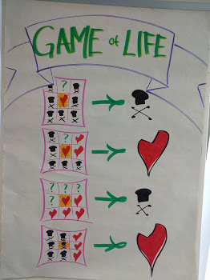

# Game of Life
## Principes
Game Of Life est un jeu basé sur une grille dont chaque cellule peut être dans deux états: vivante ❤️ ou morte ☠️.

A chaque itération, l'état de chaque cellule est défini en fonction des règles suivantes:
- Une cellule vivante ❤️ avec moins de deux voisines vivantes meurt ☠️
- Une cellule vivante ❤️ avec exactement deux ou trois voisines vivantes survit ❤️
- Une cellule vivante ❤️ avec plus de trois voisines vivantes meurt ☠️
- Une cellule morte ☠️ avec moins de trois voisines vivantes reste morte ☠️
- Une cellule morte ☠️ avec exactement trois voisines vivantes devient vivante ❤️
- Une cellule morte ☠️ avec plus de trois voisines vivantes reste morte ☠️

## Votre mission
- Etant donné le statut d'une cellule X et la liste des statuts de ses voisines, vous devez retrouver le statut de la cellule à l'itération suivante.
- Vous devez le faire en TDD avec des baby steps 😄
